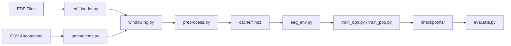

# RL-EEG-TUH: Reinforcement Learning for EEG Seizure Detection

## Technical Documentation — Complete Code-Aware Analysis

---

## 1. Project Overview

### 1.1 Problem Statement

Epileptic seizure detection from scalp EEG recordings is a critical clinical task. Manual review by neurologists is time-consuming and error-prone, especially for long-term monitoring. This project implements an automated seizure detection system using Reinforcement Learning (RL) agents trained on the Temple University Hospital (TUH) EEG Seizure Corpus.

### 1.2 Why Reinforcement Learning?

Unlike supervised classifiers that treat each EEG window independently, RL models the problem as a sequential decision-making task:

- **State**: A 2-second EEG window (19 channels × 512 samples)
- **Action**: Binary classification — Background (0) or Seizure (1)
- **Reward**: Asymmetric reward function penalizing missed seizures more heavily than false alarms
- **Episode**: One EEG recording (sequence of sliding windows)

This formulation captures the temporal nature of seizure evolution and allows the agent to develop policies sensitive to the severe class imbalance (seizures comprise ~2–5% of data).

### 1.3 End-to-End Pipeline

```
Raw EDF Files → Channel Selection → Resampling (256 Hz) → Bandpass Filter (0.5–50 Hz)
→ Z-score Normalization → Sliding Windows (2s, 50% overlap) → Label Alignment
→ Gymnasium Environment → RL Agent Training (DQN/PPO) → Evaluation & Visualization
```

---

## 2. Directory Structure

```
RL-EEG-TUH/
├── config.py                    # Central configuration (hyperparameters, paths, constants)
├── train.py                     # CLI entry point for training
├── evaluate.py                  # CLI entry point for evaluation
├── src/
│   ├── preprocessing/           # EDF loading, annotation parsing, windowing
│   │   ├── edf_loader.py        # Load & preprocess raw EDF files via MNE
│   │   ├── annotations.py       # Parse TUH CSV annotation files
│   │   ├── windowing.py         # Sliding-window segmentation with label alignment
│   │   └── preprocess.py        # Orchestrator: discover → process → cache
│   ├── environment/
│   │   └── eeg_env.py           # Custom Gymnasium environment for RL
│   ├── models/
│   │   ├── feature_extractor.py # CNN and CNN-LSTM feature extractors
│   │   ├── dqn_agent.py         # DQN agent with replay buffer
│   │   └── ppo_agent.py         # PPO agent with GAE and rollout buffer
│   ├── training/
│   │   ├── train_dqn.py         # DQN training loop
│   │   └── train_ppo.py         # PPO training loop
│   ├── evaluation/
│   │   └── evaluate.py          # Metrics, plotting, Excel export
│   └── utils/
│       └── helpers.py           # Seed, device, logging utilities
├── data/edf/{train,dev,eval}/   # TUH dataset (user-provided)
├── cache/                       # Preprocessed .npz caches
├── checkpoints/                 # Saved model weights
└── logs/                        # Training logs
```

### Data Flow



---

## 3. File-by-File Code Analysis

---

### 3.1 `config.py` — Central Configuration

**Purpose**: Single source of truth for all hyperparameters, paths, and constants.

**Key Parameters**:

| Category | Parameter | Value | Purpose |
|----------|-----------|-------|---------|
| EEG Signal | `NUM_CHANNELS` | 19 | Standard 10-20 montage |
| EEG Signal | `TARGET_SFREQ` | 256 Hz | Resampling target |
| EEG Signal | `BANDPASS_LOW/HIGH` | 0.5–50 Hz | Clinical EEG frequency range |
| Windowing | `WINDOW_SEC` | 2.0 s | Window length (512 samples) |
| Windowing | `STRIDE_SEC` | 1.0 s | 50% overlap |
| Reward | `CORRECT_SEIZ` | +3.0 | Reward for true positive |
| Reward | `CORRECT_BCKG` | +0.1 | Reward for true negative |
| Reward | `MISS_SEIZ` | −3.0 | Penalty for false negative |
| Reward | `FALSE_ALARM` | −1.0 | Penalty for false positive |
| DQN | `LR / γ / ε_decay` | 1e-4 / 0.99 / 10000 | Learning rate, discount, exploration |
| DQN | `BUFFER_SIZE` | 50000 | Replay buffer capacity |
| DQN | `TARGET_UPDATE` | 1000 | Steps between target network syncs |
| PPO | `LR / γ / λ_GAE` | 5e-4 / 0.99 / 0.95 | Learning rate, discount, GAE lambda |
| PPO | `CLIP_EPS` | 0.2 | PPO clipping epsilon |
| PPO | `ENTROPY_COEF` | 0.05 | Entropy bonus coefficient |
| PPO | `ROLLOUT_STEPS` | 2048 | Steps per rollout collection |
| PPO | `NUM_EPOCHS` | 8 | PPO update epochs per rollout |

**Design Decision**: The 19-channel list uses `-REF` suffix naming, but `edf_loader.py` normalizes to handle `-LE`, `-AVG`, `-AR` variants.

---

### 3.2 `src/preprocessing/edf_loader.py` — EDF File Loading

**Purpose**: Load raw EDF files, select channels, resample, filter, and normalize.

**Function: `load_edf(edf_path, channels, target_sfreq, bandpass_low, bandpass_high)`**

**Algorithm (step-by-step)**:
```
1. Load raw EDF via mne.io.read_raw_edf(preload=True)
2. Channel Selection (robust matching):
   a. Build normalization helper: strip "EEG " prefix + suffixes (-REF, -LE, -AVG, -AR)
   b. Create map: normalized_name → original_name for all available channels
   c. For each target channel: try exact match, then normalized match
   d. Fallback: if 0 matches, use first N channels (logs CRITICAL error)
3. Pick selected channels (ordered to match config)
4. Resample to target_sfreq (256 Hz) if different
5. Bandpass filter: FIR, 0.5–50 Hz
6. Extract numpy array: shape (n_channels, n_samples)
7. Z-score normalization per channel: x = (x - μ) / σ (σ=1 if σ=0)
8. Return (data_float32, sfreq, ch_names)
```

**Input**: Path to `.edf` file
**Output**: `(np.ndarray[n_channels, n_samples], float, List[str])`

**Assumption**: EDF files contain at least some subset of the 19 standard 10-20 channels.

---

### 3.3 `src/preprocessing/annotations.py` — Annotation Parsing

**Purpose**: Parse TUH CSV annotation files mapping time intervals to labels.

**Function: `parse_annotations(csv_path, label_map)`**

**Algorithm**:
```
1. Try parsing CSV with separators: comma first, then whitespace
2. Detect format by column count:
   - ≥5 columns: _bi.csv format → (channel, start, stop, label, probability)
   - ≥3 columns: regular CSV → (start, stop, label)
3. For each valid row:
   - Extract (start_time, stop_time) as floats
   - Map label string ("bckg"/"seiz") to integer via label_map
4. Deduplicate, sort by start_time
5. Return List[(start, end, label_int)]
```

**Function: `find_annotation_file(edf_path)`**

Searches for annotation files using TUH naming conventions:
- `base.csv_bi`, `base.csv`, `base_bi.csv`
- Recursive search in parent/sibling directories

---

### 3.4 `src/preprocessing/windowing.py` — Sliding Window Segmentation

**Purpose**: Segment continuous EEG into overlapping windows with majority-vote labels.

**Function: `create_windows(data, sfreq, annotations, window_sec, stride_sec)`**

**Algorithm**:
```
1. Compute window_samples = window_sec × sfreq (512)
2. Compute stride_samples = stride_sec × sfreq (256)
3. If signal < window_samples: pad with zeros
4. Generate start positions: range(0, n_total - window_samples + 1, stride_samples)
5. Pre-compute seizure intervals in sample units
6. For each window [win_start, win_end]:
   a. Extract data[:, win_start:win_end]
   b. Compute seizure overlap (sum of intersections with all seizure intervals)
   c. If overlap ≥ 50% of window → label = 1 (seizure), else label = 0
7. Return (windows[N, C, T], labels[N])
```

**Computational Complexity**: O(N × S) where N = number of windows, S = number of seizure intervals.

**Mathematical Detail — Overlap Computation**:
```
overlap(window, seizure) = max(0, min(win_end, seiz_end) - max(win_start, seiz_start))
label = 1  if  Σ overlap ≥ 0.5 × window_samples
```

---

### 3.5 `src/preprocessing/preprocess.py` — Pipeline Orchestrator

**Purpose**: Discover EDF files, process them through the pipeline, cache results.

**Key Functions**:

| Function | Purpose |
|----------|---------|
| `discover_edf_files(data_dir)` | Recursive glob for `*.edf`, returns sorted list |
| `process_single_file(edf_path)` | `load_edf → find_annotation → parse_annotations → create_windows` |
| `preprocess_split(split_dir, cache_path, max_files)` | Process entire split with caching |
| `preprocess_all(data_dir, max_files)` | Process train/dev/eval splits |
| `generate_synthetic_data(n_files, ...)` | Generate random EEG-like data for dry-run testing |

**Caching Logic**:
- Cache path: `cache/{split_name}_data.npz`
- If cache exists → load directly (skips all preprocessing)
- Otherwise → process all files → save as compressed `.npz`

**Channel Validation** (added fix): Files with channel count ≠ 19 are skipped and logged.

---

### 3.6 `src/environment/eeg_env.py` — Gymnasium Environment

**Purpose**: Implement EEG seizure detection as a Gymnasium `Env` for RL.

**Class: `EEGSeizureEnv(gym.Env)`**

**Spaces**:
- **Observation**: `Box(shape=(19, 512), dtype=float32)` — one EEG window
- **Action**: `Discrete(2)` — 0 (background) or 1 (seizure)

**Episode Structure**:
```
If file_boundaries provided:
    episodes = [(start_i, end_i) for each file]
Else:
    episodes = chunks of 200 windows each
```

**`reset()`**: Randomly select an episode (or cycle sequentially), return first window.

**`step(action)`**:
```
1. Get true_label for current window
2. Compute reward:
   - action == true_label == 1 → REWARD_CORRECT_SEIZ (+3.0)
   - action == true_label == 0 → REWARD_CORRECT_BCKG (+0.1)
   - true_label == 1, action == 0 → REWARD_MISS_SEIZ (-3.0)
   - true_label == 0, action == 1 → REWARD_FALSE_ALARM (-1.0)
3. Track predictions, advance step
4. If episode end reached → terminated = True, include summary stats
5. Return (next_obs, reward, terminated, False, info)
```

**Design Choice**: Asymmetric rewards are critical because seizures are ~2–5% of data. Without the 30:1 ratio between `CORRECT_SEIZ` and `CORRECT_BCKG`, the agent learns a degenerate "always predict background" policy.

---

### 3.7 `src/models/feature_extractor.py` — Neural Network Backbones

**Class: `CNNFeatureExtractor`**

**Architecture** (input: `[B, 19, 512]`):
```
Block 1: Conv1d(19→32, k=7, p=3) → BN → ReLU → MaxPool(2)    → [B, 32,  256]
Block 2: Conv1d(32→64, k=5, p=2) → BN → ReLU → MaxPool(2)    → [B, 64,  128]
Block 3: Conv1d(64→128, k=3, p=1) → BN → ReLU → MaxPool(2)   → [B, 128, 64]
AdaptiveAvgPool1d(4)                                            → [B, 128, 4]
Flatten                                                         → [B, 512]
FC(512→256) → ReLU → Dropout(0.3) → FC(256→128) → ReLU        → [B, 128]
```

**Design Rationale**: Progressively increasing filter counts (32→64→128) with decreasing kernel sizes (7→5→3) capture both broad spectral patterns and fine-grained temporal features. `AdaptiveAvgPool1d(4)` ensures fixed output regardless of input length.

**Class: `CNNLSTMFeatureExtractor`** (currently unused by agents, available for extension)

Wraps `CNNFeatureExtractor` + LSTM for capturing temporal dependencies across consecutive windows. Supports single-window mode (DQN) and sequence mode (batched sequences).

---

### 3.8 `src/models/dqn_agent.py` — Deep Q-Network Agent

**Class: `ReplayBuffer`** — Circular deque buffer storing `(state, action, reward, next_state, done)` tuples. Capacity: 50,000 transitions.

**Class: `QNetwork`** — `CNNFeatureExtractor → FC(128→64) → ReLU → Dropout(0.2) → FC(64→2)`
- Input: `[B, 19, 512]` → Output: `[B, 2]` (Q-values for actions 0 and 1)

**Class: `DQNAgent`**

| Component | Implementation |
|-----------|---------------|
| **Exploration** | ε-greedy with linear decay: ε = ε_end + (ε_start − ε_end) × max(0, 1 − steps/decay) |
| **Target Network** | Hard copy every 1000 updates |
| **Loss** | Huber loss (SmoothL1Loss) |
| **Optimizer** | Adam, lr=1e-4 |
| **Gradient Clipping** | max_norm=1.0 |
| **Double DQN** | Online network selects actions, target network evaluates them |

**Update Rule (Double DQN)**:
```
Q_target = r + γ × Q_target_net(s', argmax_a Q_online(s', a)) × (1 - done)
Loss = SmoothL1(Q_online(s, a), Q_target)
```

---

### 3.9 `src/models/ppo_agent.py` — PPO Agent

**Class: `RolloutBuffer`** — Stores trajectories `(state, action, log_prob, reward, done, value)`. Computes GAE advantages.

**GAE Computation** (from code):
```python
for t in reversed(range(T)):
    δ_t = r_t + γ × V(s_{t+1}) × (1 - done_t) - V(s_t)
    A_t = δ_t + γ × λ × (1 - done_t) × A_{t+1}
returns = advantages + values
```

**Class: `ActorCritic`**
- Shared backbone: `CNNFeatureExtractor(→ 128-dim)`
- Actor: `FC(128→64) → Tanh → FC(64→2)` → softmax → action probabilities
- Critic: `FC(128→64) → Tanh → FC(64→1)` → scalar value estimate

**Class: `PPOAgent`**

**PPO-Clip Update** (from code, per mini-batch):
```
ratio = exp(log_π_new(a|s) - log_π_old(a|s))
L_clip = -min(ratio × Â, clip(ratio, 1-ε, 1+ε) × Â)
L_value = MSE(V_new(s), returns)
L_entropy = -H(π_new)
L_total = L_clip + 0.5 × L_value + 0.05 × L_entropy
```

Advantages are normalized: `Â = (A - μ_A) / (σ_A + 1e-8)`

---

### 3.10 `src/training/train_dqn.py` — DQN Training Loop

**Function: `train_dqn(...)`**

```
1. Create EEGSeizureEnv with training data
2. Initialize DQNAgent
3. For each episode (1 to num_episodes):
   a. Reset environment → get initial state
   b. While not done:
      - Select action (ε-greedy)
      - Step environment → (next_state, reward, done, info)
      - Store transition in replay buffer
      - Sample mini-batch, compute Double DQN loss, backprop
   c. Log every 5 episodes: reward, loss, accuracy, epsilon
   d. Every eval_interval episodes:
      - Evaluate on dev set → compute F1, sensitivity, specificity
      - If F1 improves → save checkpoint as dqn_best.pt
4. Save final model as dqn_final.pt
```

---

### 3.11 `src/training/train_ppo.py` — PPO Training Loop

**Function: `train_ppo(...)`**

```
1. Create EEGSeizureEnv, initialize PPOAgent
2. While total_episodes_completed < num_episodes:
   a. Collect rollout (2048 steps):
      - For each step: select_action → env.step → store transition
      - If episode ends: log, evaluate if interval hit, reset env
   b. PPO Update:
      - Compute GAE advantages from rollout buffer
      - For 8 epochs: shuffle indices, iterate mini-batches (size 64)
      - Compute PPO-Clip loss + value loss + entropy bonus
      - Backprop with gradient clipping (max_norm=0.5)
      - Clear rollout buffer
3. Save final model as ppo_final.pt
```

**Key Difference from DQN**: PPO collects a full rollout (2048 steps across potentially multiple episodes) before performing updates, while DQN updates after every single step.

---

### 3.12 `src/evaluation/evaluate.py` — Evaluation Pipeline

**Function: `compute_metrics(true_labels, predictions)`**

Returns: accuracy, sensitivity (TP/(TP+FN)), specificity (TN/(TN+FP)), precision, F1-score, false alarm rate, confusion matrix components.

**Function: `evaluate_agent(agent, windows, labels, agent_type, device)`**

Iterates over all windows, calls `agent.select_action(state, training=False)`, collects predictions, computes metrics.

**Function: `plot_eeg_overlay(..., edf_path)`**

Clinical-style EEG plot:
- Loads raw EDF via MNE, selects and filters channels
- Stacks channel traces vertically (clinical montage style)
- Overlays seizure detections as red shaded regions
- Falls back to simple overlay if MNE unavailable

**Function: `plot_confusion_matrix(labels, predictions, save_path)`** — Seaborn heatmap.

**Function: `export_predictions_excel(labels, predictions, save_path)`** — Groups consecutive seizure windows into events with start/end/duration times, exports to `.xlsx`.

---

### 3.13 `src/utils/helpers.py` — Utilities

| Function | Purpose |
|----------|---------|
| `set_seed(42)` | Seeds `random`, `numpy`, `torch`, `torch.cuda`, sets `PYTHONHASHSEED`, enables deterministic cuDNN |
| `get_device("cuda")` | Returns `torch.device`, falls back to CPU, logs GPU name |
| `setup_logging(log_dir)` | Dual handler: console + `logs/training.log` (append mode) |
| `timer(description)` | Context manager for timing code blocks |

---

## 4. RL Formulation (Code-Derived)

### 4.1 MDP Components

| Component | Implementation | Code Reference |
|-----------|---------------|----------------|
| **State s** | `np.ndarray[19, 512]` — 2s EEG window, z-score normalized | `eeg_env.py:146` |
| **Action a** | `Discrete(2)`: 0=background, 1=seizure | `eeg_env.py:103` |
| **Reward r(s,a)** | See reward table below | `eeg_env.py:173-183` |
| **Transition** | Deterministic: advance to next window | `eeg_env.py:190-196` |
| **Episode** | One chunk of ~200 windows (or one file) | `eeg_env.py:74-81` |
| **Discount γ** | 0.99 (both DQN and PPO) | `config.py:75,88` |

### 4.2 Reward Function

| Condition | Reward | Rationale |
|-----------|--------|-----------|
| Correct seizure detection (TP) | +3.0 | Strong incentive to detect seizures |
| Correct background (TN) | +0.1 | Minimal reward to avoid "always seizure" |
| Missed seizure (FN) | −3.0 | Heavy penalty — clinical safety critical |
| False alarm (FP) | −1.0 | Moderate penalty to limit false positives |

The 30:1 ratio between seizure reward and background reward, combined with symmetric ±3.0 for correct/missed seizure, creates an asymmetric incentive structure calibrated for ~3% seizure prevalence.

---

## 5. Model Architecture (As Implemented)

### 5.1 Shared CNN Backbone

```
Input: [B, 19, 512]
  ↓
Conv1d(19→32, k=7, stride=1, pad=3) → BatchNorm1d(32) → ReLU → MaxPool1d(2)
  → [B, 32, 256]
  ↓
Conv1d(32→64, k=5, stride=1, pad=2) → BatchNorm1d(64) → ReLU → MaxPool1d(2)
  → [B, 64, 128]
  ↓
Conv1d(64→128, k=3, stride=1, pad=1) → BatchNorm1d(128) → ReLU → MaxPool1d(2)
  → [B, 128, 64]
  ↓
AdaptiveAvgPool1d(output_size=4)
  → [B, 128, 4]
  ↓
Flatten → [B, 512]
  ↓
Linear(512→256) → ReLU → Dropout(0.3) → Linear(256→128) → ReLU
  → [B, 128]
```

### 5.2 DQN Head

```
Q-Network: CNN_backbone(→128) → Linear(128→64) → ReLU → Dropout(0.2) → Linear(64→2)
Output: Q(s, a=0), Q(s, a=1)
```

### 5.3 PPO Actor-Critic Heads

```
Actor:  CNN_backbone(→128) → Linear(128→64) → Tanh → Linear(64→2) → Softmax
Critic: CNN_backbone(→128) → Linear(128→64) → Tanh → Linear(64→1)
```

---

## 6. Training Pipeline

### 6.1 Execution Order

```
train.py main()
  ├── setup_logging() + set_seed(42) + get_device()
  ├── preprocess_split(train_dir)    # or generate_synthetic_data() if --dry_run
  ├── preprocess_split(dev_dir)
  └── train_dqn() or train_ppo()
        ├── Create EEGSeizureEnv(windows, labels)
        ├── Create Agent
        ├── Training loop (num_episodes iterations)
        │     ├── Collect experience
        │     ├── Update network parameters
        │     ├── Log metrics every 5 episodes
        │     └── Evaluate on dev set every eval_interval episodes
        ├── Save best checkpoint (based on F1 score)
        └── Save final checkpoint
```

### 6.2 Checkpoint Logic

- **Best model**: Saved when dev F1 score exceeds previous best → `checkpoints/{agent}_best.pt`
- **Final model**: Always saved at training end → `checkpoints/{agent}_final.pt`
- Contents: network state dict, optimizer state dict, step counters

---

## 7. Evaluation Pipeline

### 7.1 Metrics Computation

From `compute_metrics()`, all derived from the confusion matrix `[[TN, FP], [FN, TP]]`:

| Metric | Formula | Clinical Meaning |
|--------|---------|------------------|
| Sensitivity | TP / (TP + FN) | Proportion of seizures correctly detected |
| Specificity | TN / (TN + FP) | Proportion of backgrounds correctly identified |
| Precision | TP / (TP + FP) | Of all "seizure" predictions, how many are correct |
| F1-Score | 2 × P × R / (P + R) | Harmonic mean of precision and recall |
| False Alarm Rate | FP / (FP + TN) | Rate of false seizure alerts |

### 7.2 Detailed Evaluation Mode (`--detailed`)

Per EDF file:
1. Process single file → get windows and labels
2. Run agent inference → get predictions
3. Export events to Excel (`.xlsx`) with start/end/duration
4. Generate clinical EEG overlay plot (`.png`)
5. Save global confusion matrix heatmap

---

## 8. End-to-End Execution Flow

### When `python train.py --agent ppo --data_dir ./data --epochs 50000` is run:

```
1. Parse CLI arguments
2. setup_logging("logs/") → creates logs/training.log
3. set_seed(42) → deterministic random, numpy, torch, cuda
4. get_device("cuda") → detects GPU
5. preprocess_split("data/edf/train"):
   a. Check for cache/train_data.npz → if exists, load and return
   b. discover_edf_files() → glob **/*.edf, sort
   c. For each EDF file:
      - load_edf() → channel match → resample → filter → normalize
      - find_annotation_file() → locate matching CSV
      - parse_annotations() → extract (start, end, label) tuples
      - create_windows() → slice into 2s windows with 50% overlap
      - Validate channel count == 19 (skip otherwise)
   d. Concatenate all windows → save to cache/train_data.npz
6. preprocess_split("data/edf/dev") → same process for dev data
7. train_ppo(train_windows, train_labels, dev_windows, dev_labels, 50000):
   a. Create EEGSeizureEnv (chunks data into ~200-window episodes)
   b. Create PPOAgent (ActorCritic network on GPU)
   c. Outer loop until 50000 episodes completed:
      - Collect 2048-step rollout across multiple episodes
      - Compute GAE advantages
      - PPO-Clip update for 8 epochs with batch_size=64
      - Evaluate on dev set every 10 episodes
      - Save best model by F1 score
   d. Save final model → checkpoints/ppo_final.pt
```

---

## 9. Reproducibility Guide

### 9.1 Prerequisites

```bash
# Python 3.11+ recommended (3.13 tested)
pip install torch torchvision torchaudio --index-url https://download.pytorch.org/whl/cu118
pip install mne numpy pandas matplotlib seaborn scikit-learn gymnasium tqdm openpyxl
```

### 9.2 Data Setup

```
data/
└── edf/
    ├── train/   # TUH EEG training files (.edf + .csv_bi pairs)
    ├── dev/     # TUH EEG development files
    └── eval/    # TUH EEG evaluation files
```

### 9.3 Training Commands

```bash
# DQN on all files (recommended: 50000 episodes)
python train.py --agent dqn --data_dir ./data --epochs 50000

# PPO on all files
python train.py --agent ppo --data_dir ./data --epochs 50000

# Quick test with 100 files
python train.py --agent ppo --data_dir ./data --epochs 6000 --max_files 100

# Dry run (synthetic data, no real data needed)
python train.py --agent dqn --dry_run --epochs 5
```

### 9.4 Evaluation Commands

```bash
# Evaluate best DQN on dev set
python evaluate.py --agent dqn --split dev

# Detailed evaluation with plots and Excel
python evaluate.py --agent ppo --split eval --detailed

# With specific checkpoint
python evaluate.py --agent dqn --checkpoint ./checkpoints/dqn_best.pt --split eval
```

### 9.5 Cache Management

Delete cache to force re-preprocessing:
```bash
del cache\train_data.npz cache\dev_data.npz
```

---

## 10. Future Extensions (Code-Aware)

### 10.1 Adding a New RL Agent

1. Create `src/models/new_agent.py` following the interface:
   - `select_action(state, training) → action`
   - `store_transition(...)`, `update()`, `save(path)`, `load(path)`
2. Create `src/training/train_new.py` following `train_dqn.py` pattern
3. Add agent choice to `train.py` and `evaluate.py` CLI parsers
4. Add hyperparameters to `config.py`

### 10.2 Extension Points

| Extension | Where to Modify |
|-----------|----------------|
| Multi-class detection (seizure types) | `config.py:LABEL_MAP`, `eeg_env.py:action_space`, model heads |
| Temporal context (LSTM) | Replace `CNNFeatureExtractor` with `CNNLSTMFeatureExtractor` (already implemented) |
| Different reward schemes | `config.py:REWARD_*` or pass `reward_scheme` dict to `EEGSeizureEnv` |
| Additional EEG channels | Update `config.py:EEG_CHANNELS` list |
| Different window sizes | Change `config.py:WINDOW_SEC` and `STRIDE_SEC` |
| Prioritized replay | Subclass `ReplayBuffer` in `dqn_agent.py` |
| Learning rate scheduling | Add scheduler in `train_dqn.py` / `train_ppo.py` |

### 10.3 Known Limitations

1. **No online learning**: Agent trains on cached static data, not streaming EEG
2. **No attention mechanism**: CNN backbone treats all timepoints equally
3. **Episode boundary artifacts**: Chunking into 200-window episodes may split seizures
4. **Single-window decisions**: No temporal context in DQN (each window classified independently)
5. **Fixed window size**: 2-second windows may not capture all seizure morphologies

---

*Document generated from source code analysis of RL-EEG-TUH project (18 source files, ~3,500 lines of code).*
